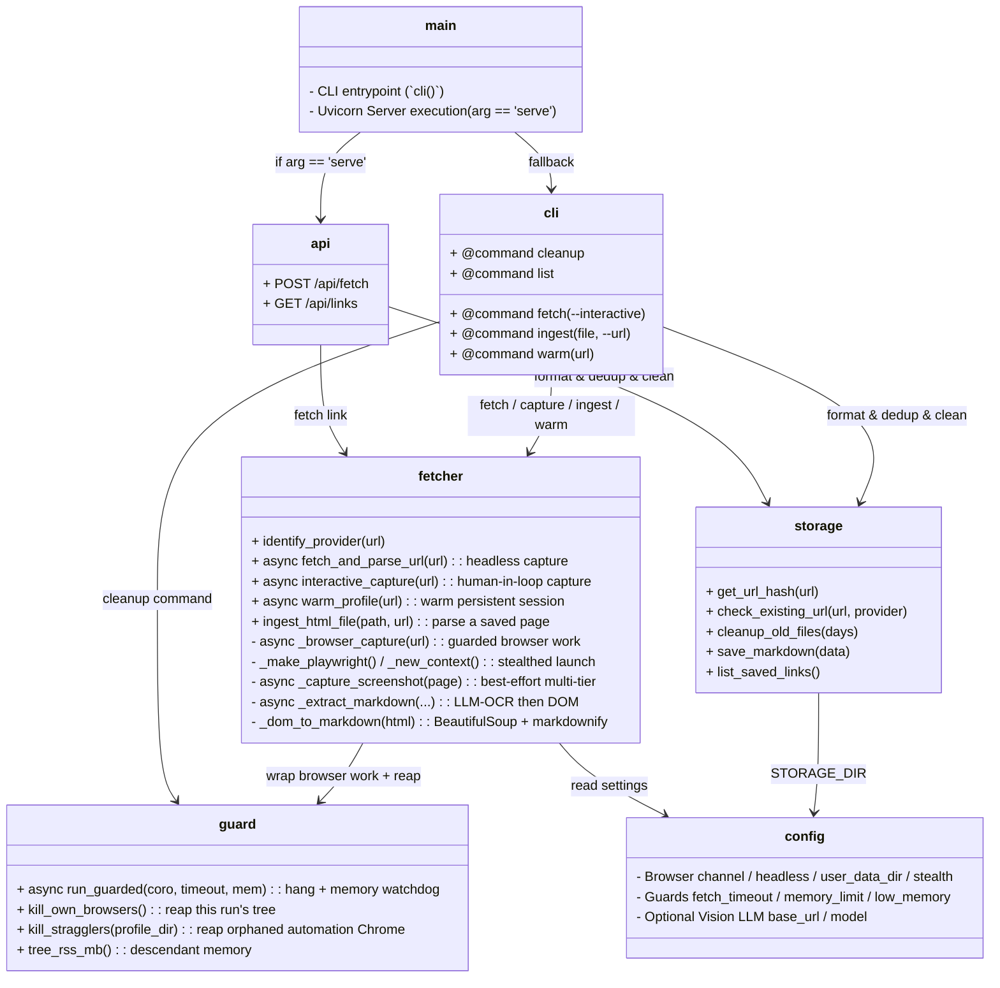

# Application Architecture

This diagram illustrates the application layers and their corresponding file modules.

```mermaid
classDiagram
    class main {
        - CLI entrypoint (`cli()`)
        - Uvicorn Server execution (arg == 'serve')
    }

    class api {
        + POST /api/fetch
        + GET /api/links
    }

    class cli {
        + @command fetch (--interactive)
        + @command ingest (file, --url)
        + @command warm (url)
        + @command cleanup
        + @command list
    }

    class fetcher {
        + identify_provider(url)
        + async fetch_and_parse_url(url) : headless capture
        + async interactive_capture(url) : human-in-loop capture
        + async warm_profile(url) : warm persistent session
        + ingest_html_file(path, url) : parse a saved page
        - async _browser_capture(url) : guarded browser work
        - _make_playwright() / _new_context() : stealthed launch
        - async _capture_screenshot(page) : best-effort multi-tier
        - async _extract_markdown(...) : LLM-OCR then DOM
        - _dom_to_markdown(html) : BeautifulSoup + markdownify
    }

    class guard {
        + async run_guarded(coro, timeout, mem) : hang + memory watchdog
        + kill_own_browsers() : reap this run's tree
        + kill_stragglers(profile_dir) : reap orphaned automation Chrome
        + tree_rss_mb() : descendant memory
    }

    class config {
        - Browser channel / headless / user_data_dir / stealth
        - Guards fetch_timeout / memory_limit / low_memory
        - Optional Vision LLM base_url / model
    }

    class storage {
        + get_url_hash(url)
        + check_existing_url(url, provider)
        + cleanup_old_files(days)
        + save_markdown(data)
        + list_saved_links()
    }

    main --> cli : fallback
    main --> api : if arg == 'serve'

    api --> fetcher : fetch link
    api --> storage : format & dedup & clean

    cli --> fetcher : fetch / capture / ingest / warm
    cli --> storage : format & dedup & clean
    cli --> guard : cleanup command

    fetcher --> guard : wrap browser work + reap
    fetcher --> config : read settings
    storage --> config : STORAGE_DIR
```
