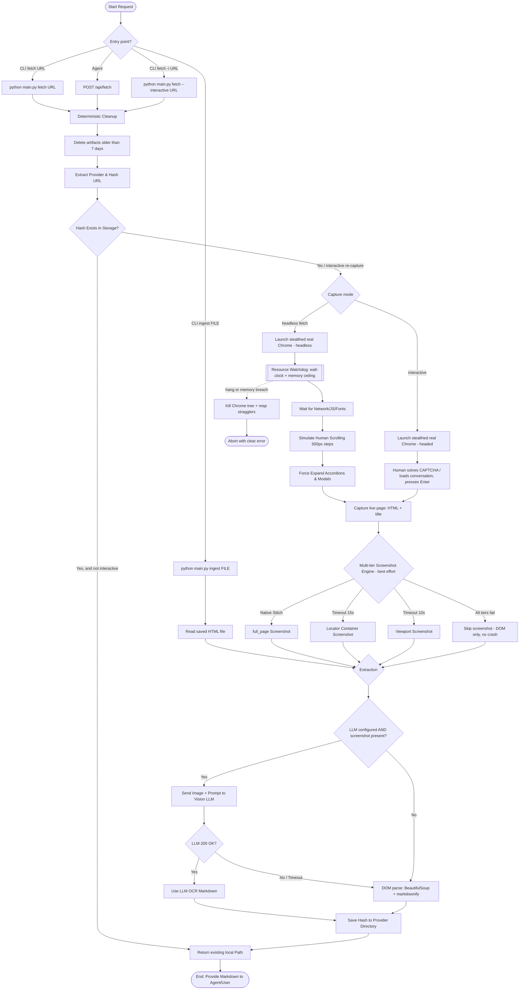

# Process Flow Architecture

This diagram illustrates the operational process triggered whenever a capture request is initiated by a user or an agent. There are three capture modes — automated headless `fetch`, human-in-loop `fetch --interactive`, and `ingest` of an already-saved page — that converge on one shared extraction + storage pipeline.

