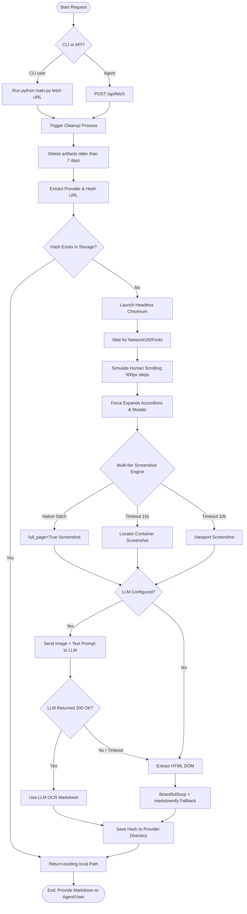

# Process Flow Architecture

This diagram illustrates the operational process triggered whenever a fetch request is initiated by a user or an agent.

```mermaid
flowchart TD
    A([Start Request]) --> B{CLI or API?}
    B -->|CLI user| C[Run python main.py fetch URL]
    B -->|Agent| D[POST /api/fetch]
    
    C --> E[Trigger Cleanup Process]
    D --> E
    
    E --> F[Delete artifacts older than 7 days]
    F --> G[Extract Provider & Hash URL]
    
    G --> H{Hash Exists in Storage?}
    H -->|Yes| I[Return existing local Path]
    
    H -->|No| J[Launch Headless Chromium]
    J --> K[Wait for Network/JS/Fonts]
    K --> L[Simulate Human Scrolling 500px steps]
    L --> M[Force Expands Accordions & Modals]
    
    M --> N{Multi-tier Screenshot Engine}
    N -->|Native Stitch| O[full_page=True Screenshot]
    N -->|Timeout 15s| P[Locator Container Screenshot]
    N -->|Timeout 10s| Q[Viewport Screenshot]
    
    O & P & Q --> R{LLM Configured?}
    
    R -->|Yes| S[Send Image + Text Prompt to LLM]
    S --> T{LLM Returned 200 OK?}
    
    T -->|Yes| U[Use LLM OCR Markdown]
    T -->|No / Timeout| V
    R -->|No| V[Extract HTML DOM]
    
    V --> W[BeautifulSoup + markdownify Fallback]
    
    U --> X[Save Hash to Provider Directory]
    W --> X
    
    X --> I
    I --> Y([End: Provide Markdown to Agent/User])
```
